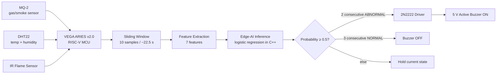
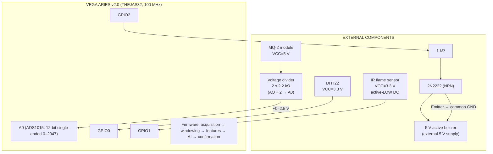
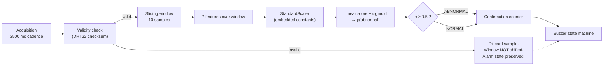
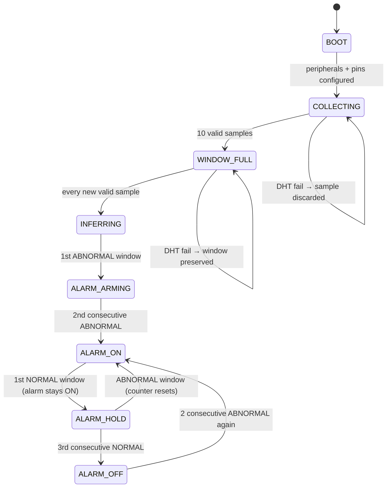

# VEGA Sentinel

**Edge-AI Multi-Sensor Anomaly Detection for Enclosed Space Safety**

> A resource-constrained multi-sensor Edge-AI safety system that learns the normal environmental behaviour of an enclosed space and detects abnormal temporal patterns **locally** on the indigenous VEGA ARIES v2.0 RISC-V platform — enabling real-time safety response without cloud connectivity.

**Team:** Abnormal Detectors · Sri Sivasubramaniya Nadar College of Engineering (SSNCE)
**Hackathon:** EMBRIX'26 – VEGATHON 2026 · **Track 2 – Edge AI & TinyML Challenge**
**Target platform:** VEGA ARIES v2.0 (THEJAS32 / VEGA ET1031 RISC-V, 100 MHz)

---

## Table of Contents

1. [Problem Statement](#1-problem-statement)
2. [Solution](#2-solution)
3. [Why Edge AI](#3-why-edge-ai)
4. [Why VEGA ARIES v2.0](#4-why-vega-aries-v20)
5. [Hardware Architecture](#5-hardware-architecture)
6. [AI Pipeline](#6-ai-pipeline)
7. [Sensor Table](#7-sensor-table)
8. [Wiring Overview](#8-wiring-overview)
9. [Sliding-Window Methodology](#9-sliding-window-methodology)
10. [Features](#10-features)
11. [Current Model](#11-current-model)
12. [Firmware Architecture](#12-firmware-architecture)
13. [Safety Confirmation Logic](#13-safety-confirmation-logic)
14. [Dataset Methodology](#14-dataset-methodology)
15. [Current Experimental Results](#15-current-experimental-results)
16. [Known Limitations](#16-known-limitations)
17. [Development Status](#17-development-status)
18. [Future Improvements](#18-future-improvements)
19. [How to Reproduce](#19-how-to-reproduce)
20. [Repository Structure](#20-repository-structure)
21. [Team](#21-team)
22. [Hackathon Information](#22-hackathon-information)

---

## 1. Problem Statement

Enclosed spaces — laboratories, server rooms, storage areas, hostel rooms, workshops — can develop dangerous conditions from smoke, gas-related events, abnormal temperature/humidity drift, or fire. Conventional solutions face a dilemma:

- **Simple threshold alarms** (a buzzer that fires when one sensor crosses a fixed limit) ignore how environmental conditions *change together over time*. They need manual tuning, are sensor-specific, and produce false alarms or missed events.
- **Cloud-based smart systems** require connectivity, add latency and cost, and raise privacy/deployment concerns — and a safety device that stops working when the Wi-Fi drops is not acceptable for a safety function.

There is a need for an **affordable, self-contained system** that (a) observes multiple environmental sensors together, (b) learns what "normal" looks like for a *specific* space, and (c) raises a local alarm when the *temporal pattern* of those sensors becomes abnormal — all without leaving the device.

## 2. Solution

VEGA Sentinel fuses three low-cost sensors — **MQ-2** (gas/smoke-related sensor response), **DHT22** (temperature + humidity), and an **IR flame sensor** — on the **VEGA ARIES v2.0** RISC-V board. Every 2.5 s it samples all sensors, maintains a **10-sample sliding window** (~22.5 s of history), extracts **7 statistical features**, and runs a **trained logistic-regression classifier** entirely on-board in C++ (no frameworks, no cloud). A **temporal confirmation layer** requires 2 consecutive abnormal AI windows before activating a buzzer (and 3 consecutive normal windows to clear it), preventing single-window noise from triggering the alarm.



The system is intentionally **learned, not hand-coded**: the decision boundary is trained on real collected data. We deliberately did *not* replace the AI with `if (flame == 1) buzzer = ON` — see [Current Experimental Results](#15-current-experimental-results) for an honest discussion of a real failed detection and how we respond to it (better data, not shortcuts).

## 3. Why Edge AI

- **Safety must not depend on connectivity.** Inference runs on the MCU itself; the alarm works with no network, no gateway, no cloud.
- **Latency.** Detection-to-alarm is bounded by the sampling interval (2.5 s per window step), not by network round-trips.
- **Privacy & cost.** No data leaves the device; no server bills.
- **Temporal patterns, not single thresholds.** Features like `mq2_range`, `mq2_delta`, and `humidity_std` capture *dynamics over time* — information a single-threshold alarm throws away.
- **Feasibility.** A 7-feature linear model with a sigmoid costs a few hundred bytes of flash and microseconds of CPU — genuinely TinyML-scale, suited to 256 KB SRAM / 2 MB flash.

## 4. Why VEGA ARIES v2.0

| Item | Value (from official C-DAC/VEGA documentation) |
|---|---|
| Processor | THEJAS32 / VEGA ET1031 (RISC-V) |
| Clock | 100 MHz |
| SRAM | 256 KB |
| Flash | 2 MB |
| I/O voltage | 3.3 V |
| Max I/O current | 12 mA per I/O |
| Analog inputs | 4 (A0–A3) |
| Arduino IDE support | Arduino IDE 1.8.19 + VEGA Arduino package |

Official sources: [C-DAC ARIES v2.0](https://www.cdac.in/index.aspx?id=product_details&productId=ARIESv2.0) · [VEGA ARIES v2](https://vegaprocessors.in/ariesv2.php) · [Datasheet](https://vegaprocessors.in/files/ARIESv2%200_Datasheet_v2.pdf) · [Pinout](https://vegaprocessors.in/files/PINOUT_ARIES%20V2.0_.pdf)

Reasons for choosing it beyond the hackathon requirement:

- **Indigenous platform.** Building and documenting a working Edge-AI system on India's RISC-V ecosystem is itself a statement — edge AI is possible outside the usual ARM/ESP32 tooling.
- **Sufficient I/O.** 4 analog inputs (via onboard ADS1015) + GPIO with Arduino API support cover the full sensor set with room to spare.
- **Honest constraints.** 256 KB SRAM forced disciplined engineering: direct C/C++ inference, fixed-size windows, no dynamic allocation — exactly the constraints TinyML is about.
- **Verified capabilities only.** Everything we claim about the board comes from the datasheet, the VEGA Arduino core (C-DAC v1.1.2), or our own tests. We do not claim TFLite Micro or other framework support we have not verified on ARIES v2.0.

> ⚠️ **Board identity:** This project targets **VEGA ARIES v2.0** — *not* "ARIES IoT v2.0". All pins, code, and documentation refer specifically to ARIES v2.0.

## 5. Hardware Architecture



Key hardware facts (all physically verified on our ARIES v2.0 board):

- `analogRead()` on ARIES v2/v3/micro (VEGA core **C-DAC v1.1.2**) is served by the onboard **ADS1015**; the effective **single-ended reading is ≈ 0–2047**. MQ-2 values in this repo are **raw ADC counts**, not ppm.
- The flame sensor module was **experimentally verified active-LOW** (LOW = flame detected).
- The buzzer is **never driven directly from a GPIO** (max 12 mA per I/O): a **2N2222 + 1 kΩ base resistor** switches the buzzer from an external 5 V rail.

## 6. AI Pipeline



Full methodology: [docs/tinyml-model.md](docs/tinyml-model.md).

## 7. Sensor Table

| Sensor | Measures | Interface | ARIES v2.0 pin | Supply | Notes |
|---|---|---|---|---|---|
| MQ-2 module | Gas/smoke-related sensor response (raw ADC) | Analog (AO) | A0 | 5 V | Through 2× 2.2 kΩ divider (halves AO). DO unused. Not a calibrated ppm instrument. |
| DHT22 | Temperature (°C), relative humidity (%) | 1-wire (bit-banged) | GPIO0 | 3.3 V | Direct bit-banged driver, checksum-verified; ≥2 s between reads. |
| IR flame sensor | IR flame indication (binary) | Digital (DO) | GPIO1 | 3.3 V | Active-LOW (verified). `flame = (raw == LOW) ? 1 : 0`. |
| 5 V active buzzer | Audible alarm | Via 2N2222 driver | GPIO2 → 1 kΩ → base | External 5 V | GPIO sources only ~0.26 mA base current; transistor does the switching. |

## 8. Wiring Overview

```
DHT22:                        MQ-2:                         FLAME SENSOR:
  VCC  → ARIES 3.3V              VCC → 5V                      VCC → ARIES 3.3V
  DATA → ARIES GPIO0             GND → GND                     GND → ARIES GND
  GND  → ARIES GND               AO  → voltage divider         DO → ARIES GPIO1
                                  DO  → (not used)

MQ-2 VOLTAGE DIVIDER:         BUZZER DRIVER (2N2222):
                                 ARIES GPIO2
  MQ-2 AO                        → 1 kΩ → 2N2222 Base
    |                            2N2222 Emitter → GND
   2.2 kΩ                        2N2222 Collector → buzzer −
    |                            Buzzer + → external 5V
    +----→ ARIES A0              External 5V GND → common GND
    |
   2.2 kΩ
    |
   GND
```

Detailed wiring with connections tables: [docs/sensor-wiring.md](docs/sensor-wiring.md) · [hardware/wiring/](hardware/wiring/)

## 9. Sliding-Window Methodology

- **Sampling interval:** 2500 ms (bounded by DHT22's ≥2 s read requirement).
- **Window:** last **10 valid samples** → **~22.5 s** of environmental history.
- **Behaviour:** first 10 valid samples fill the window; after that, each new valid sample shifts the window by one and inference runs immediately — so a **new AI decision every ~2.5 s**.
- **Invalid samples (DHT22 checksum failure):** the sample is **discarded**; the window is **not shifted**, no inference runs, and the current alarm state is preserved. (This fixes a real bug in the earlier firmware — see [CHANGELOG](CHANGELOG.md) and [docs/testing.md](docs/testing.md).)
- **Training/offline consistency:** the offline pipeline generates windows with the *same* size-10, one-sample-shift logic used on-device, so the feature distribution the model learned from matches deployment.

## 10. Features

Seven features computed over each 10-sample window (exact definitions in [docs/tinyml-model.md](docs/tinyml-model.md)):

| # | Feature | Meaning |
|---|---|---|
| 1 | `humidity_mean` | Mean relative humidity in window |
| 2 | `temp_mean` | Mean temperature in window |
| 3 | `mq2_range` | max − min of MQ-2 raw ADC in window (variability) |
| 4 | `mq2_delta` | Last − first MQ-2 value in window (trend) |
| 5 | `mq2_std` | Sample std (n−1) of MQ-2 in window (volatility) |
| 6 | `humidity_std` | Sample std (n−1) of humidity |
| 7 | `flame_fraction` | Fraction of window samples with flame detected |

## 11. Current Model

**Model A** — logistic regression (trained with scikit-learn, `class_weight="balanced"`, `random_state=42`) on standardised features, executed on-device as plain C++ (standardisation + dot product + sigmoid). Decision rule: `p ≥ 0.5 → ABNORMAL`.

| Feature | Coefficient | Scaler mean | Scaler scale |
|---|---|---|---|
| humidity_mean | −2.610233 | 73.242897 | 1.548508 |
| temp_mean | +0.422538 | 28.448692 | 0.203029 |
| mq2_range | +0.384768 | 11.616822 | 17.851226 |
| mq2_delta | −0.322069 | 0.485981 | 14.173402 |
| mq2_std | −0.751392 | 3.734761 | 5.900505 |
| humidity_std | +0.561356 | 0.115325 | 0.163725 |
| flame_fraction | +0.890513 | 0.004673 | 0.031721 |
| **Intercept** | **−3.483560** | | |

*These constants are the authoritative copy: they are auto-generated by `ml/deployment/export_model_to_cpp.py` into [firmware/sentinel_final/model.h](firmware/sentinel_final/model.h), and reproduce the reference probabilities in §15 exactly.*

**Status: development model, not final.** See [docs/tinyml-model.md](docs/tinyml-model.md) for the full parameter set, C++ verification results, and honest status.

## 12. Firmware Architecture



Firmware tiers under [firmware/](firmware/):

| Tier | Sketches | Purpose |
|---|---|---|
| `board_tests/` | 01_hello_world, 02_rgb_led_test, 03_adc_test, 08_simple_demo | Board package, serial, RGB LED, buttons, ADS1015 ADC — no external wiring needed for 01/02/08 |
| `sensor_tests/` | 04_mq2_raw_read, 05_dht22_test, 06_combined_acquisition | Per-sensor verification against pass criteria |
| `data_collection/` | 07_data_logger | CSV rows over serial for dataset building |
| `sentinel_final/` | sentinel_final (full system), model_a_aries_test (model math check) | Deployment firmware + on-board model verification |

## 13. Safety Confirmation Logic

The AI's window classification feeds a deliberately conservative state machine:

- **2 consecutive ABNORMAL windows → buzzer ON.** One noisy window can never trip the alarm.
- **3 consecutive NORMAL windows while alarm active → buzzer OFF.** Alarm doesn't flutter off and on.
- **DHT22-failure samples: state fully preserved** — a sensor glitch neither triggers nor clears alarms.
- **Threshold is fixed at 0.5** and is **not tuned** to force a demonstration to pass. (This is an explicit project rule — see [MASTER_CONTEXT.md](MASTER_CONTEXT.md).)

## 14. Dataset Methodology

- **Sampling:** all sensors every 2500 ms; DHT22 checksum verified; rows with `dht_ok=0` excluded from training.
- **Format:** `timestamp_ms,temp_c,humidity_pct,mq2_adc,flame_state,dht_ok` (firmware) enriched by the PC logger with `laptop_timestamp,label,experiment,phase`.
- **Labels:** `normal` / `warning` / `critical`; **phases:** `baseline` / `event` / `recovery`.
- **Honest labeling:** some historical files contain artificial/test labels and are **excluded** from training-data claims (listed in [dataset/README.md](dataset/README.md)). No fabricated measurements.
- **Windows:** size 10, stride 10 (non-overlapping) for the v3 processed dataset; deployment uses stride 1 (sliding). **Overlap leakage concern** is documented; the planned retrain uses trial-level validation splits.
- **Current scale:** 107 windows — 100 normal, 7 abnormal (~16 min normal + ~5 min of controlled flame trials). **Too small for real-world accuracy claims.**

Full methodology: [docs/dataset-methodology.md](docs/dataset-methodology.md).

## 15. Current Experimental Results

Everything in this section is either computed from the committed dataset or was directly observed on hardware. **Development results — not final validated performance.**

| Result | Value | Source / status |
|---|---|---|
| Model A CV accuracy (7-fold stratified, random split) | **0.9446 mean** (folds: 0.9375, 0.875, 1.0, 0.9333, 0.8667, 1.0, 1.0) | Reproducible: `ml/training/train_model.py` — **development result with leakage caveats** |
| Model A leave-one-trial-out mean | **0.7449** (5 folds) | Reproducible: `ml/validation/validate_model.py` — leakage-aware; the honest development number |
| Model A reference normal window | p(abnormal) = **0.018949** → NORMAL | Reproduced in C++ on ARIES |
| Model A reference abnormal window | p(abnormal) = **0.992752** → ABNORMAL | Reproduced in C++ on ARIES |
| Real controlled flame trial | Flame sensor detected flame (flame_fraction reached 0.1 in a live window); AI probability ≈ 0.34 → classified **NORMAL** → buzzer stayed OFF | Physically observed on ARIES; a documented failure case |

The 0.9446 → 0.7449 drop from random-split CV to trial-level validation
quantifies the overlap-leakage problem and motivates the planned dataset
expansion. Neither number is a real-world accuracy claim.

**How we interpret the failure case (important):** the current model/data combination did not generalize to that real event. The response is *not* to hard-code `flame → buzzer` and call it AI — the response is to collect more, better-separated data (20–30 min normal + multiple supervised abnormal trials) and retrain, with trial-level validation. The single-flame-sample feature (`flame_fraction = 0.1`) sits inside the learned normal region because the training set contains too few flame examples. This failure is preserved in the repo (dataset + docs) as a first-class engineering result.

We do **not** claim: real-world accuracy numbers, "95% accurate system", ppm measurement, detection of every hazardous gas, or certified fire detection.

## 16. Known Limitations

1. **Dataset size** — 107 windows (7 abnormal). Insufficient for robust generalization claims.
2. **Overlap leakage risk** — historical cross-validation randomly split overlapping windows from the same trial; the 0.9446 figure must be read with this caveat. Trial-level splits are planned but not yet performed.
3. **Real flame event missed** — documented above; root cause is data scarcity, not architecture.
4. **MQ-2 is not calibrated** — raw ADC response only; no ppm claims.
5. **Humidity drift dominates** — the room's baseline humidity drifts on minute scales and the current scaler constants absorb this; a future model may need adaptive baselines or drift features.
6. **No final benchmark numbers** — on-device inference timing / memory measurements are not yet documented.
7. **Prototype only** — no certification, no claim of being a life-safety device.

## 17. Development Status

**Completed:** hardware bring-up (serial, GPIO, RGB LED, buttons, ADS1015 ADC), MQ-2 / DHT22 / flame sensor integration, multi-sensor CSV logging pipeline, transistor buzzer driver (physically tested), 7-feature engineering, ML training pipeline, Model A C++ reproduction + on-ARIES execution, sliding-window inference architecture, AI→buzzer confirmation logic, DHT-failure window-preservation fix.

**In progress / next (priority order):** dataset + model improvement — see §18.

**Not finished (do not mark complete):** final training dataset; final model; trial-level validation; robust false-positive evaluation; final physical validation; enclosure/prototype packaging; dashboard; presentation; on-device benchmark measurements; deployment memory/timing documentation.

## 18. Future Improvements

**Immediate (the current priority — dataset + model refinement):**

1. Collect **20–30 min of normal environment** data.
2. Collect **multiple safe, supervised abnormal trials** (small controlled flame/smoke sources, physically separated from electronics).
3. Record **recovery** after each event.
4. Regenerate windows with the **same sliding-window method as deployment**.
5. **Avoid random overlap leakage** between windows from the same trial.
6. **Split validation by experiment/trial** where possible.
7. Retrain, evaluate false-positive rate and abnormal recall.
8. Deploy improved model to ARIES and repeat physical tests.
9. Only then finalize the model.

**Later:** adaptive baselines (humidity drift), per-space personalization, on-device inference timing/memory benchmarks, enclosure design, optional long-term logging dashboards.

## 19. How to Reproduce

### Arduino setup (VEGA ARIES v2.0)

1. Install **Arduino IDE 1.8.19**.
2. File → Preferences → Additional Board Manager URLs:
   `https://gitlab.com/riscv-vega/vega-arduino/-/raw/main/package_vega_index.json`
3. Boards Manager → install **VEGA ARIES Boards** (core **C-DAC v1.1.2** used in development).
4. Tools → Board → **VEGA Processor: ARIES Boards → ARIES v2**.
5. Connect board via USB, select the COM port, Serial Monitor at **115200** baud.
6. Open any sketch under [firmware/](firmware/), upload, observe pass criteria in serial output.

### Python setup (ML pipeline)

```bash
# Python 3.9+ recommended
python -m venv .venv
.venv\Scripts\activate          # Windows
pip install -r requirements.txt

# Full pipeline on the committed dataset:
python ml/data_processing/generate_windows.py            # raw -> window features (v3 logic)
python ml/feature_analysis/analyze_features.py           # normal-vs-abnormal separation report
python ml/training/train_model.py                        # trains Model A, reproduces CV + constants
python ml/validation/validate_model.py                   # model comparison + leakage-aware eval
python ml/deployment/export_model_to_cpp.py              # regenerates firmware/sentinel_final/model.h
```

Each stage writes reproducible outputs under `results/`. Expected: CV mean ≈ 0.9446 on the committed v3 dataset (± floating-point/BLAS differences).

### Hardware build

Follow [docs/sensor-wiring.md](docs/sensor-wiring.md) → run `sensor_tests` sketches → run `07_data_logger` + `tools/data_logger/sentinel_logger.py` for new data → flash `sentinel_final` for the full system.

## 20. Repository Structure

```
VEGA-Sentinel/
├── README.md                  ← you are here
├── MASTER_CONTEXT.md          ← complete project context (for future contributors/AI assistants)
├── CHANGELOG.md
├── LICENSE                    ← MIT
├── requirements.txt
├── firmware/                  ← Arduino sketches for ARIES v2.0
│   ├── board_tests/           ← 01 hello, 02 RGB LED, 03 ADC, 08 onboard demo
│   ├── sensor_tests/          ← 04 MQ-2, 05 DHT22, 06 combined acquisition
│   ├── data_collection/       ← 07 CSV data logger
│   └── sentinel_final/        ← full system + on-board model verification
├── ml/                        ← reproducible Python ML pipeline
│   ├── data_processing/       ← cleaning + sliding-window generation
│   ├── feature_analysis/      ← normal-vs-abnormal separation analysis
│   ├── training/              ← Model A training (scaler + logistic regression)
│   ├── validation/            ← model comparison, leakage-aware validation
│   └── deployment/            ← export model parameters to C++ header
├── dataset/
│   ├── README.md              ← dataset documentation + provenance
│   ├── raw/                   ← 5 meaningful raw CSVs (as collected)
│   ├── processed/             ← window-feature datasets (v3 + archives)
│   └── sample/                ← small sample demonstrating the format
�/sample
├── hardware/
│   ├── README.md
│   ├── bom.md                 ← bill of materials
│   ├── wiring/                ← connection tables
│   └── schematics/            ← ASCII schematics
├── tools/
│   ├── data_logger/           ← PC-side serial dataset logger (v0.4)
│   └── visualization/         ← dataset plotting
├── docs/                       ← deep-dive documentation
├── results/                    ← experiment + model results (real, committed)
├── images/                     ← placeholder dirs for photos/diagrams (add real photos)
└── .gitignore
```

## 21. Team

**Team Abnormal Detectors** (4 members) — Sri Sivasubramaniya Nadar College of Engineering (SSNCE), Tamil Nadu, India.

Roles: firmware & embedded C/C++ (ARIES v2.0), ML pipeline & training, hardware & sensor integration, documentation & testing.

## 22. Hackathon Information

- **Event:** EMBRIX'26 – VEGATHON 2026
- **Track:** Track 2 – Edge AI & TinyML Challenge
- **Platform:** VEGA ARIES v2.0
- **Team:** Abnormal Detectors · SSNCE
- **Positioning:** a resource-constrained multi-sensor Edge-AI safety system that learns normal environmental behaviour of an enclosed space and detects abnormal temporal patterns locally on the indigenous VEGA RISC-V platform — no cloud connectivity required.

We explicitly do **not** claim: complete fire prediction, exact gas concentration, detection of every hazardous gas, medical-grade safety, industrial certification, guaranteed fire detection, or superior performance vs. other MCUs without measured evidence.

---

## Safety Notice

This is a **safety-oriented prototype**, not a certified safety device. Never create dangerous gas concentrations, uncontrolled fire, or hazardous atmospheres when testing. Controlled flame experiments must be **small, supervised, and physically separated from electronics**. The MQ-2 is not a calibrated gas concentration instrument; this project describes its output as "gas/smoke-related sensor response" and claims no ppm values.

## License

MIT — see [LICENSE](LICENSE). © 2026 Team Abnormal Detectors (VEGA-Sentinel), SSNCE.
