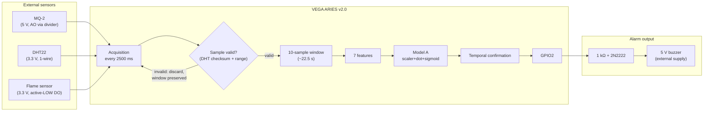

# System Architecture — VEGA Sentinel

## End-to-end data flow



## Real-time sequence (final firmware)

1. Every 2500 ms (bounded below by DHT22's ≥2 s read requirement):
   - Read DHT22 (bit-banged, checksum-verified) into temporaries.
   - Read MQ-2 (single `analogRead(A0)`, raw counts 0–2047).
   - Read flame DO (active-LOW → normalised to 1 = flame).
   - Emit CSV row: `timestamp_ms,temp_c,humidity_pct,mq2_adc,flame_state,dht_ok`.
2. **Validity gate** (the fixed firmware bug — see below): if DHT22 invalid
   or values out of plausible range → discard the sample; the window is
   **not** shifted, no inference runs, alarm state preserved.
3. If valid: shift the 10-sample window, insert the newest sample.
4. Once the window is full (and for every subsequent valid sample):
   compute the 7 features → standardise → linear score → sigmoid → p(abnormal).
5. Classification: `p ≥ 0.5 → ABNORMAL` (threshold fixed, never tuned for demos).
6. Temporal confirmation state machine:
   - 2 consecutive abnormal → buzzer ON.
   - While alarm active: 3 consecutive normal → buzzer OFF; an abnormal window resets the normal counter.
7. Buzzer via GPIO2 → 1 kΩ → 2N2222 → 5 V buzzer (external rail, common GND).

### The fixed sliding-window bug

Earlier firmware shifted the window before verifying the new DHT22 sample,
so stale values could persist as if fresh. Correct order (implemented in
`firmware/sentinel_final/sentinel_final.ino`):

```
read all sensors → TEMPORARIES
if DHT invalid:   discard sample (window untouched, alarm preserved)
else:             shift window → insert → features → inference → confirmation
```

## Software blocks

| Block | Location | Responsibility |
|---|---|---|
| Board bring-up tests | `firmware/board_tests/` | IDE, serial, RGB LED, buttons, ADC (ADS1015) |
| Sensor tests | `firmware/sensor_tests/` | MQ-2, DHT22, combined acquisition — each with pass criteria |
| Data collection | `firmware/data_collection/` + `tools/data_logger/` | CSV rows over serial → validated, labelled PC-side dataset |
| Windowing & features | `ml/data_processing/` + firmware | identical 10-sample window logic offline and on-device |
| Training & validation | `ml/training/`, `ml/validation/` | logistic regression, CV, leakage-aware LOTO |
| Deployment export | `ml/deployment/` | constants JSON → auto-generated `model.h` |
| Final system | `firmware/sentinel_final/` | full pipeline incl. confirmation logic |
| Visualization | `tools/visualization/` | session plots for data QA |

## Resource notes (256 KB SRAM / 2 MB flash)

- Static buffers only in firmware: window arrays = 3×10 floats + 10 bytes.
- Model A storage: 21 floats + intercept ≈ 100 bytes flash.
- Inference cost: 7 multiply-adds + 1 sigmoid per window step (~microseconds at 100 MHz). Exact on-device timing not yet benchmarked — "Not yet validated".

## Serial protocol (final firmware)

```
timestamp_ms,temp_c,humidity_pct,mq2_adc,flame_state,dht_ok     # data rows (every 2500 ms)
AI,p=<probability>,status=<NORMAL|ABNORMAL>                      # decision line after each window step
>>> ALARM ACTIVATED (2 consecutive ABNORMAL)                     # confirmation events
>>> ALARM CLEARED (3 consecutive NORMAL)
DHT22 invalid - sample discarded (window preserved)              # validity-gate events
```
